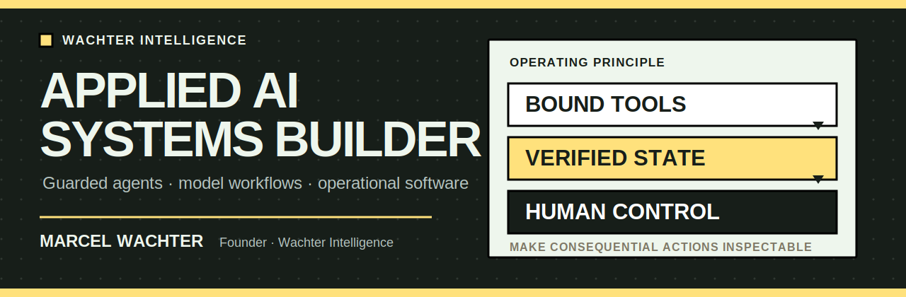
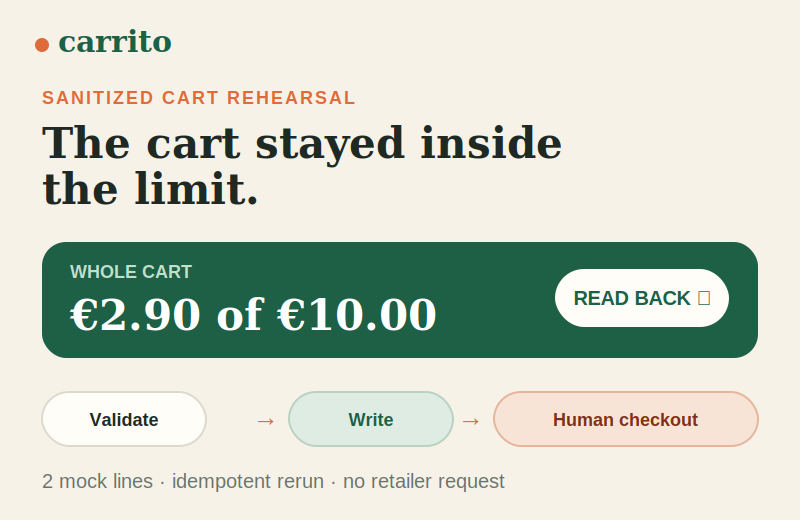
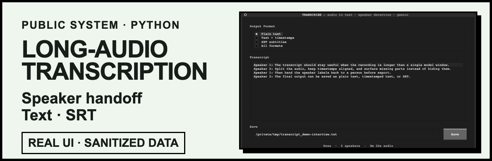
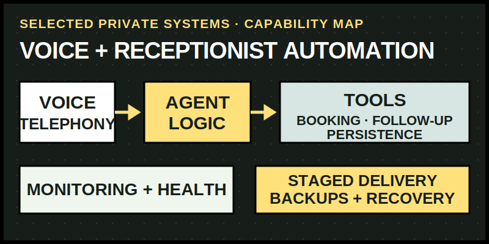

  

I turn messy, cross-system workflows into applied-AI products that people can inspect and control. I own the path from workflow analysis through interfaces, integrations, tests, and operational safeguards.

  <a href="https://wachter.ai"><strong>Wachter Intelligence</strong></a>
  &nbsp;·&nbsp;
  <a href="https://wachter.ai/results">Selected systems</a>

## Selected public systems

  

**Guarded agent actions.** A Go CLI and portable agent skill that separates model planning from deterministic spend checks, cart writes, read-back, bounded rollback, and human-controlled checkout. The visual uses a reproducible local mock run with sanitized demo data. [**Source and architecture →**](https://github.com/wachtermar/carrito/blob/main/docs/architecture.md)

  

**Long-running model workflows.** A terminal transcription tool with audio preview, long-file splitting, speaker handling, rate-limit preflight, and SRT or text output. The proof card shows the real interface with a sanitized demo transcript, not a claimed model result. [**Source and setup →**](https://github.com/wachtermar/transcribe#quick-start)

## What I build

| System layer | What I own |
|---|---|
| **Agent systems** | Tool boundaries, deterministic validation, read-back verification, failure stops, and human approval. |
| **Operational products** | Workflow discovery, interfaces, backend services, data flow, and third-party integration. |
| **Long-running AI workflows** | Input preparation, chunking, model calls, split/upload/transcribe progress, recovery, and structured output. |
| **Delivery and reliability** | Tests, health checks, staged deployment, monitoring, backups, and operating documentation. |

## Selected private systems

  

Selected private work includes voice and receptionist automation with telephony, booking, follow-up, persistence, monitoring, and deployment safeguards. The repositories, client details, provider topology, and operating data stay private.

## Technical range

**TypeScript · React · Node.js · Python · FastAPI · Go · Postgres · Docker · Cloudflare · telephony and model APIs**

I run [Wachter Intelligence](https://wachter.ai), an applied-AI systems studio focused on operational workflows. For technical review, start with [Carrito’s public safety architecture](https://github.com/wachtermar/carrito/blob/main/docs/architecture.md) or the [Transcribe setup](https://github.com/wachtermar/transcribe#quick-start). You can also find me on [LinkedIn](https://www.linkedin.com/in/marcel-wachter/).
